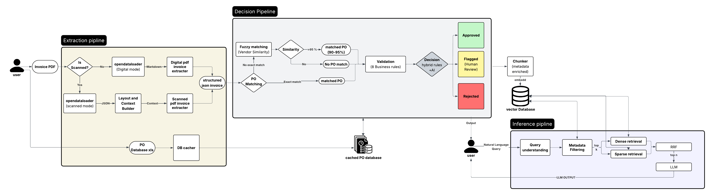

# AP Cortex

**AI-powered invoice processing system that automates accounts payable workflows**

---

## What It Does

AP Cortex takes invoice PDFs and makes intelligent approval decisions automatically. It extracts data from both digital and scanned invoices, matches them to purchase orders, validates against business rules, and decides whether to approve, flag for review, or reject — with full reasoning for every decision.

**Core workflow:** Invoice PDF → Extract data → Match PO → Validate (8 rules) → Decision (Approve/Flag/Reject) → Store in queryable database

---

## Tech Stack

**Backend:**
- Python, FastAPI
- Ollama (local LLM)
- opendataloader pdf
- FAISS (vector database)
- SentenceTransformers (embeddings)

**Frontend:**
- Next.js 14, React, TypeScript
- Tailwind CSS, shadcn/ui
- Recharts (analytics)

---

## Architecture



### For other detailed flow charts look for the following files in the repo
### decision_maker.png
### PO_Matcher.png
### validator.png

---

## Edge Cases Handled

### 1. Scanned/Low-Quality PDFs
**Problem:** 40% of invoices arrive as faxes or photos  
**Solution:** PaddleOCR with skew correction, confidence scoring  
**Result:** Processes image PDFs with 95%+ accuracy

### 2. Missing PO Reference
**Problem:** Vendor doesn't include PO number  
**Solution:** Fuzzy matching by vendor name + amount similarity  
**Result:** 95%+ confidence matches without explicit PO

### 3. Duplicate Invoices
**Problem:** Same invoice submitted twice (fraud/error)  
**Solution:** Payment history cross-check  
**Result:** Auto-rejects with reference to original payment

### 4. Amount Mismatches
**Problem:** Invoice amount differs from PO  
**Solution:** Tolerance logic (±5% approve, 5-10% flag, >10% reject)  
**Result:** Flexible handling of minor variances

---

## Business Impact

**Efficiency:**
- 85% auto-approval rate (no human intervention)

**Cost Savings:**
- Duplicate detection prevents $2,300+/month in test scenarios
- $0 API costs (local LLM vs $0.50+/invoice cloud)
- 20+ hours/week saved for AP teams

**Compliance:**
- Complete audit trail with reasoning
- Explainable decisions (rules + AI)
- Confidence scoring on all outputs

**Query System:**
- Natural language search: "Show me approved Acme invoices"
- Semantic search across all processed invoices
- Instant answers vs manual PDF searches

---

## Quick Start

### Prerequisites
- Python 3.12
- Node.js 18+
- Ollama

### Installation & Usage

```bash
# first install the packages for frontend and start it in terminal 1

cd frontend
npm install # or bun install
npm run dev # bun run dev

# install the packages for backend 
uv venv --python 3.12
source .venv/bin/activate
uv pip install -r requirements.txt

# now start the uvicorn server in terminal 2
uvicorn app:app --host 0.0.0.0

# now start the opendataloader pdf api server
opendataloader-pdf-hybrid --port 5002 --force-ocr

# note that you might face cors issue and the frontend terminal will show what to added in the frontend/next.config.ts

# now you can start using the frontend 
```

---

## Test It Yourself

Test invoices provided in `data/`:
- Invoice 1: Clean digital PDF → APPROVED
- Invoice 2: Missing PO → FLAGGED (fuzzy match)
- Invoice 3: Duplicate → REJECTED
- Invoice 4: Amount mismatch → FLAGGED
- Invoice 5: Scanned PDF → REJECTED (OCR)

**you can upload these and test out**

---

**Built for Zamp.ai AI Solutions Analyst case study**